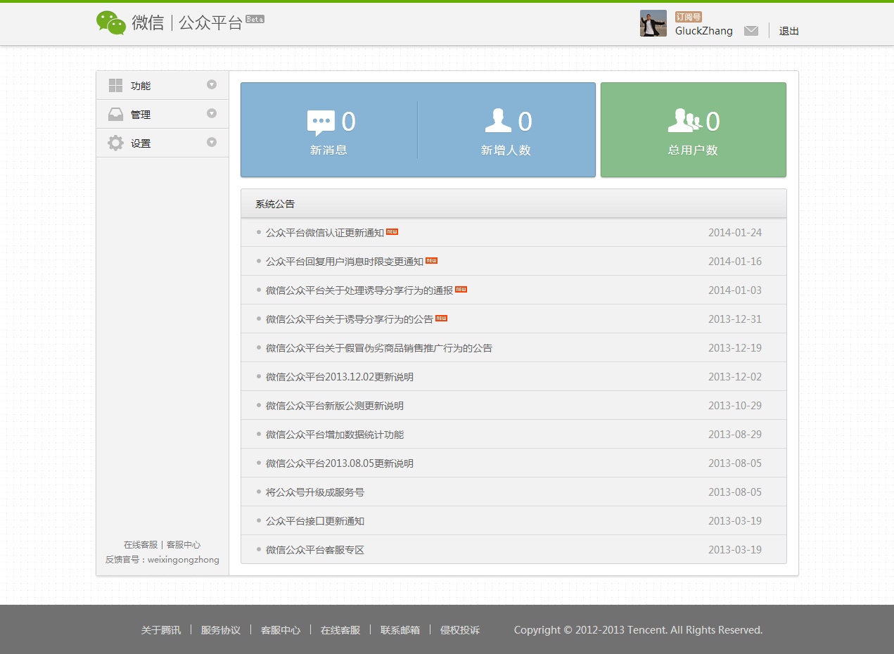

##微信公众平台注册流程
可以使用邮箱进行注册，基本分为5个步骤，需要填写的信息比较多，流程包括：  

- 输入邮箱，接收验证邮件并激活账号
- 登记信息，运用主体选择个人时，填写信息包括姓名、身份证号、联系方式、所属单位等，并需要**上传一张手持身份证的近照**供审核使用（如果类型选企业，则除了个人信息还要输入营业执照等信息）
- 填写信息之后将选择公共帐号类型，运营主体为个人时，只能选择订阅号（确定之后不能更改）
- 最后设定公众号基本信息，包括帐号名称、简介、头像等（基本信息可以修改，但是得申请，频率有限制）

所有信息填写完之后，会有一个等待审核的过程，待审核公众号不能使用服务、统计相关功能，好像也不能群发信息。审核一般一两天就会通过，之后登陆公众平台出现的首页是这样的：  

此时在站点上已经可以进行群发消息、用户管理、查询统计等基本功能了，可以满足我们去年大赛的运营类公众帐号的需求。  
在功能菜单的高级功能页面，可以开启公众号的开发模式，第一步是需要申请成为开发者，这需要有自己的服务器（或者类似的云服务），服务器地址得到验证后即可开启开发模式，能够使用一下基本接口：  

> 接收用户消息：能够识别和接收用户发来的不同类型消息，如文本、图片、语音等。
> 向用户回复消息：用户向账号发送消息时，可以进行回复，回复消息类型包括普通文本、图文消息等，但是只能回复1条。即被动响应用户的消息，不能主动推送。
> 接受事件推送：即用户进行了一些操作时，会给服务器发送一则消息，事件类型包括关注/取消、扫描带参数的二维码、上报地理位置

申请成为开发者的过程比较简单，文档写的很清楚，去年我也弄过相关的上手教程，选手应该很容易将自己的服务器设置为微信公众帐号的服务器。  
其实以上3类基本接口，配合着HTML的页面，可以实现不少功能，我们去年大赛的多数作品就只是用到了上面这些基本接口。

##一些有用的高级接口
公众平台现在提供的开发者文档完善了许多，说明很清楚，例子也不少，对于开发者来说挺容易阅读的，以下是开发者文档的主目录，我从里面挑选了几个参赛团队可能比较期待的接口（尤其前两个，用的比较多）。

> 新手接入
> 基础支持
> 接收消息
> 发送消息
> 用户管理
> 自定义菜单
> 推广支持
> Weixin JS接口
> 开发者交流互助

###基础支持->上传下载多媒体文件
这个接口蛮重要的，因为回复用户消息时，如果想要回复图片、语音、视频，就要先把这类资源上传到微信的服务器上，而上传操作并不在基本接口里面。没有授权这个接口时，公众号只能回复纯文本、图文消息给用户，消息类型不够丰富。

###发送消息->发送客服消息
当用户主动发消息给公众号的时候（包括发送信息、点击自定义菜单click事件、订阅事件、扫描二维码事件、支付成功事件、用户维权），微信将会把消息数据推送给开发者，开发者在一段时间内（目前修改为48小时）可以调用客服消息接口，通过POST一个JSON数据包来发送消息给普通用户，**在48小时内不限制发送次数**。  
即主动向客户推送消息，去年有几支参赛队通过“模拟登陆”的方式实现了这个功能，做了一些比较特别的应用，估计现在微信已经不允许那样做了。如果有主动推送的权限，那么创新点又多了不少，例如可以做一些群组游戏类的公众帐号，大家组局之后服务器可以向参与人推送游戏信息，而不需要玩家每次都要主动发送消息给公众号。

###用户管理->获取用户基本信息、获取关注者列表
服务器可以通过这类接口拿到用户的基本信息，如微信昵称、所在城市、头像等，也可以取得关注自己帐号的用户列表。这类接口可能会在交友、圈子类型的公众号里面用到，如果有些团队有这方面的创意，可能会比较期待。  
不过这类接口权限不开放也没关系，可以通过关注时引导用户进入一个页面，填入一些基本信息来弥补。

###自定义菜单
属于锦上添花的内容，没有自定义菜单其实也能实现公众号各项功能，自定义菜单主要是改善用户体验，如果能够申请下来则更好。

##平台其他方面的一些改进
添加了很多开发者交流互助方面的内容，包括开发者问答系统、接口调试工具、接口体验测试号申请。有了这些工具，加上比较详细的文档，可以说进一步降低了入门难度。