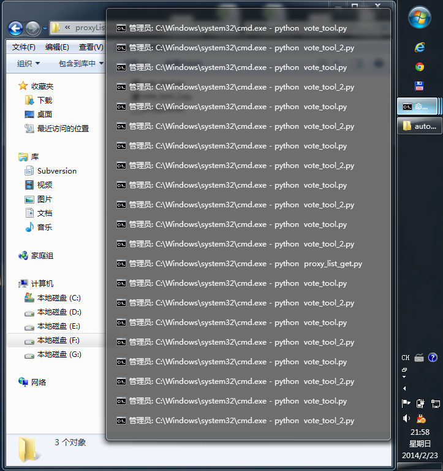

#Windows控制台下如何让程序后台执行
前几天刷票，开了好多python脚本在跑，当时不晓得如何把任务设定在后台执行，于是出现这种壮观场景。



其实，Windows中也可以将命令放在后台执行，类似于Linux里面在执行脚本末尾加上`&`符号。具体命令是`start`，详细用法可以通过`start /?`查看，将任务放在后台运行的选项是/b，例如后台执行当前目录下的`vote_tools.py`，可以写成：  

	start /b python vote_tools.py

如果脚本有很多的控制台输出，可以将其重定向到文件，即：

	start /b python vote_tools.py > result.log

#当前进程与服务的查看
类似于我们使用的任务管理器、Linux中的ps，其实cmd下也有一个查看进程与服务状态的命令，就是`tasklist`，直接输入命令会显示当前所有进程的名称、pid、内存用量等。为了便于找到我们需要的进程，一般会使用选项`/fi`，即“filter”。

```
筛选器名称        有效操作符                  有效值
-----------     ---------------           --------------------------
STATUS          eq, ne                    RUNNING | NOT RESPONDING | UNKNOWN
IMAGENAME       eq, ne                    映像名称
PID             eq, ne, gt, lt, ge, le    PID 值
SESSION         eq, ne, gt, lt, ge, le    会话编号
SESSIONNAME     eq, ne                    会话名
CPUTIME         eq, ne, gt, lt, ge, le    CPU 时间，格式为
                                          hh:mm:ss。
                                          hh - 时，
                                          mm - 分，ss - 秒
MEMUSAGE        eq, ne, gt, lt, ge, le    内存使用量，单位为 KB
USERNAME        eq, ne                    用户名，格式为 [domain\]user
SERVICES        eq, ne                    服务名称
WINDOWTITLE     eq, ne                    窗口标题
MODULES         eq, ne                    DLL 名称
```

举个例子，查找所有以“chrome”开头的进程状态，命令写成：

	tasklist /fi "imagename eq chrome*"