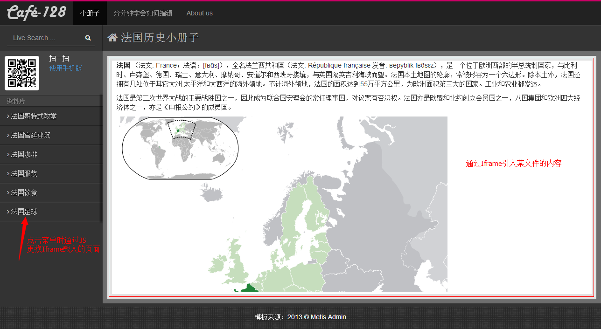

Iframe标记，又叫浮动帧标记，可以用它将一个HTML文档嵌入在另一个HTML中显示，一个简单的应用就是页面局部内容的更新，或者TabPanel形式的管理界面，就像下面两个图一样。




Iframe的基本形式：

	<iframe id="contentFrame" name="contentFrame" src="welcome.html"></iframe>

###通过JS更换iframe中的内容：

	$("#contentFrame").attr("src", pageUrl)

###在iframe中获取父页面的对象：
子页面中通过parent.document可以获得父页面的document对象，然后可取到iframe对象并修改其高度。

```
<script>
	function adjustHeight() {
		parent.document.getElementById("contentFrame").style.height = (document.body.scrollHeight + 10) + "px";
	}
</script>
<body onload="adjustHeight()">
……
</body>
```

###父页面中访问iframe中的DOM：
以获得document对象为例，不同的浏览器操作方式略有不同，IE、Firefox中可以通过以下代码：  

	document.getElementById('contentFrame').contentWindow.document

Firefox中还可以使用`XXFrameObject.contentDocument`来获取子页面document对象。不过随着浏览器版本的提升，可能会对两种获取方法都支持，代码中最好还是先判断一下浏览器类型或者取到的object是不是undefined。

*注：本地调试时可能会报“Uncaught SecurityError: Blocked a frame with origin "null" from accessing a frame with origin "null". Protocols, domains, and ports must match.”，代码部署到服务器上就不会出现问题了。*