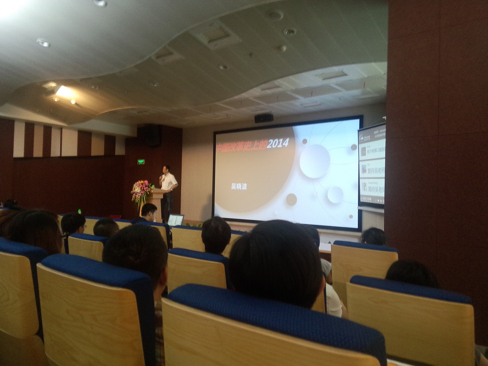

　　腾讯学院·领导力名家之声邀请了财经作家、“蓝狮子”财经图书出版人吴晓波教授为大家做分享，原定主题《当今中国经济形势下腾讯的机会、挑战与收获》，但吴老师很谦虚、低调，觉得这个主题自己并不能讲得透彻，所以现场分享主题是《中国改革史上的2014》。  

##0. 吴晓波简介  
　　吴晓波，1968年生人，毕业于复旦大学新闻系。财经作家，“蓝狮子”财经图书出版人，上海交通大学、暨南大学EMBA课程教授，常年从事公司研究。2009年被《南方人物周刊》评为年度“中国青年领袖”。  
　　代表作品《大败局》、《激荡三十年》、《跌荡一百年》、《浩荡两千年》，近期还在撰写《腾讯传》。喜欢经济学的朋友可以关注公众帐号“**吴晓波频道**”。

##1. 中国的经济改革  
　　伟大or失败？经济学家的观点两极分化很严重，一部分认为2020年后期赶超美国是大概率事件，一部分认为经济正在崩溃。

##2. 中国36年的改革史  
###1978年，告别经典意义的社会主义：私人财产为什么被容忍出现  
　　当时国人有两大迷信：GDP迷信、全球化迷信。即只要GDP上涨，其他问题自然会解决；只要中国走向全球，其他问题自然会解决。  
　　中国的经济改革在世界上很特别，因为是一场没有理论支持的改革。  
###1980年代，增量改革时期：农民如何从事工商业  
　　毛泽东时期是短缺经济，通过各种票据来防止物价上涨。  
　　当时只要能生产出商品，就能赚到钱。  
　　经济觉悟是经济全球化的一个结果，策略：进口替代、空间换技术。  
###1990年代，整体配套改革时期：民企的壮大与国企的复苏  
　　标识：企业需要做广告与品牌  
　　两次创业潮：1992年，邓小平南巡之后，十万公务员人下海经商；1998-1999年，互联网创业季（主要人物是60后、70后）  
　　1998年出现了“Made in China”，它的衰落是在2007~2008年，而阿里的B2B业务是随着“Made in China”一同衰落的。  
　　1998年政府取消公务员分房制度、鼓励按揭贷款，房地产时代自此开启。目前，胡润榜中国富豪中60%的人主营业务都是地产。  
　　1998年，全国兴建高速公路。  
　　垄断性企业通过“牌照”拿钱，互联网企业绕过牌照与之对抗。  
　　**这一阶段主要是轻型化经济，围绕吃、穿、用方面。**  
###2000年代，全球化时期：中国特色的产业经济模式  
　　2003~2012年泡沫最为严重，经历两次“国退民进”，体现民营企业的金融饥渴。  
　　这一阶段主要是外向型经济，重工业化路径。

##3. 2014，改革第四个周期，第8个宏观波动周期  
　　宏观经济层面，十八届三中全会后的五个经济改革热点：行政审批及市场准入制度改革、土地改革、金融改革、国有企业改革、社会主义体制改革。  
　　8~10年/5~8年，主营金融业，出现大的金控公司。  
　　2014年改革已进入“下半场时间”，是经济发展和各层利益之前的权衡。  
　　从个人、家庭的角度来讲，货币目前很不安全，应该全投资出去，并且还要向银行借钱。  
　　中国的经济有没有未来？这要看两个方面：制造业、城镇化，而我们谈论很多的互联网，其实会变成一种工具，渗透到各行各业中去。

##4. 产业层面的变化  
- 大数据，小制造  
- 非电子，无商务  
- 告别北上广深  
- 80、90后主导世界  
- 不确定的未来

结尾的slide只有一句话：**2014年，一切坚硬的都将烟消云散。**  

##5. Q&A  
没有来得及记录大家的提问，这里先分享吴教授的一些观点。  

- 房地产10年内不会崩盘  
- “互联网金融”是一个中国名词，2年之后可能消失，银行行业会发生基于互联网的变化，可能出现金融行业大规模的并购，若干城市银行出局，出现大的金控集团。  
- 让我们难以想到的是金融革命由互联网公司发动。  
- 比特币毫无未来（没有具体讲，只有这一句话= =）  
- 个人理财方面的一些建议  
　　当老板才能跑赢膨胀，对于打工者来说，我们可以看两个指标。一是职务型收入与财产型收入之比（即工资收入与投资收入的比例），达到`1:1`才算走近中产阶级，财产型收入>职务型收入退休才比较好，如果100%都是工资收入，那就是纯屌丝无疑了（楼主就是这样的╮(╯▽╰)╭）；二是计算家庭负债比（即贷款等负债总额占家庭总资产的比例），60%是一个比较合理的比例，由于膨胀，**不负债是对家庭的极大犯罪**。  
- 阿里、腾讯做银行的优劣？  
　　阿里之前为淘宝卖家做小额贷款，现在主要在B2B领域给企业做大额贷款，未来的重点可能也是在企业放贷方向，国家会比较支持，因为不会影响到金融基本盘；腾讯最大的资源是用户信息，所以在做虚拟信用卡，直接攻打金融大本营（个人感觉吴老师言外之意是会遇到一些挑战和阻力）。  
- 中国现代化进程的标识？  
　　中国有他自己的独特性，与欧美发达国家不同，原因之一是对国家统一的追求，可以说这是一个国家的先天基因。中国的现代化道路长度要超过一代人的生命长度，所以我们可能看不到了，也不好说标识是什么。  
- 传统行业的互联网化，核心始终是“东西是不是够好”  
- 如何看待有钱之后的移民？  
　　分两面来看，对于国家来说，好处是这一批人将人民币的祸水带到全世界，但他们的投资和资产其实很多还在国内；坏处是这些移民者回国谈生意的时候，立场变了，会越来越凶猛、激进，破坏力更强。  
- 中国最难：企业敢于投资，民众敢于消费  
- 企业级应用的发展前景如何？  
　　目前国内中小企业基本盘，老板们主要是60后、70后，他们对互联网没有概念，而且不可被教育，所以在中国企业级应用发展的并不好。但在未来3~5年，当前的老板们会被洗牌、淘汰，企业级应用会有很大市场，有爆发式发展。  

> 成为一个对社会有用的人，在一个高增长的行业里工作，顺便有点钱，这样其实会很幸福，最应该做的就是投资自己。  ——  吴晓波
